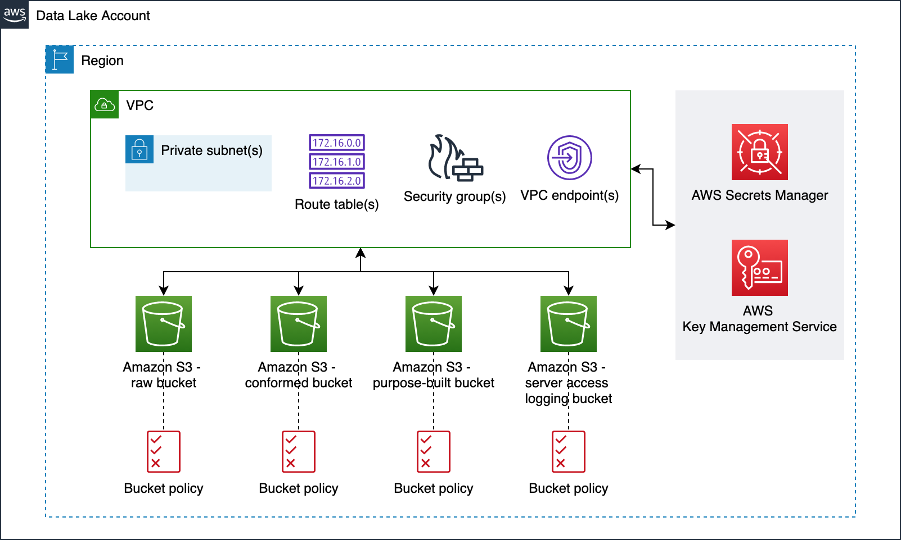
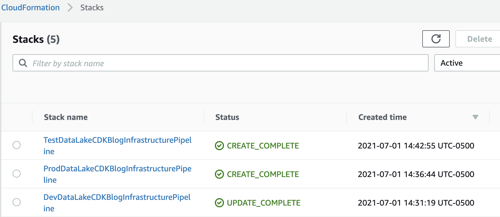

# CDK Pipelines for Data Lake Infrastructure Deployment

This solution helps you deploy data lake infrastructure on AWS using [CDK Pipelines](https://docs.aws.amazon.com/cdk/latest/guide/cdk_pipeline.html).
This is based on AWS blog [Deploy data lake ETL jobs using CDK Pipelines](https://aws.amazon.com/blogs/devops/deploying-data-lake-etl-jobs-using-cdk-pipelines/). We recommend you to read the blog before you proceed with the solution.

[CDK Pipelines](https://docs.aws.amazon.com/cdk/api/latest/docs/pipelines-readme.html) is a construct library module for painless continuous delivery of CDK applications. CDK stands for Cloud Development Kit. It is an open source software development framework to define your cloud application resources using familiar programming languages.

This solution helps you:

1. deploy data lake infrastructure on AWS using CDK Pipelines
1. leverage the benefit of self-mutating feature of CDK Pipelines. For example, whenever you check your CDK app's source code in to your version control system, CDK Pipelines can automatically build, test, and deploy your new version
1. increase the speed of prototyping, testing, and deployment of new ETL workloads

---

## Contents

* [Data lake](#data-lake)
  * [Architecture](#architecture)
  * [Infrastructure](#infrastructure)
* [The solution](#the-solution)
  * [Centralized deployment](#centralized-deployment)
  * [Continuous delivery of data lake infrastructure](#continuos-delivery-of-data-lake-etl-using-cdk-pipelines)
  * [Source code structure](#source-code-structure)
  * [Automation scripts](#automation-scripts)
* [Prerequisites](#prerequisites)
  * [Software installation](#software-installation)
  * [Logistical requirements](#logistical-requirements)
  * [AWS environment bootstrapping](#aws-environment-bootstrapping)
  * [Application configuration](#application-configuration)
  * [AWS CodePipeline and GitHub integration](#aws-codepipeline-and-github-integration)
* [Deployment](#deployment)
  * [Deploying for the first time](#deploying-for-the-first-time)
  * [Iterative Deployment](#iterative-deployment)
* [Data lake ETL jobs](#data-lake-etl-jobs)
* [Additional resources](#additional-resources)
  * [Clean up](#clean-up)
  * [AWS CDK](#aws-cdk)
  * [Developer guide](#developer-guide)
* [Authors and reviewers](#authors-and-reviewers)
* [License Summary](#license-summary)

---

## Data lake

In this section we talk about Data lake architecture and its infrastructure.

---

### Architecture

To level set, let us design a data lake. As shown in the figure below, we use Amazon S3 for storage. We use three S3 buckets - 1) raw bucket to store raw data in its original format 2) conformed bucket to store the data that meets the quality requirements of the lake 3) purpose-built data that is used by analysts and data consumers of the lake.

The Data Lake has one producer which ingests files into the raw bucket. We use AWS Lambda and AWS Step Functions for orchestration and scheduling of ETL workloads.

We use AWS Glue for ETL and data cataloging, Amazon Athena for interactive queries and analysis. We use various AWS services for logging, monitoring, security, authentication, authorization, notification, build, and deployment.

**Note:** [AWS Lake Formation](https://aws.amazon.com/lake-formation/) is a service that makes it easy to set up a secure data lake in days. [Amazon QuickSight](https://aws.amazon.com/quicksight/) is a scalable, serverless, embeddable, machine learning-powered business intelligence (BI) service built for the cloud. These two services are not used in this solution.


---

### Infrastructure

Now we have the Data Lake design, let's deploy its infrastructure. It includes the following resources:

 1. Amazon Virtual Private Cloud (VPC)
 1. Subnets
 1. Security Groups
 1. Route Table(s)
 1. VPC Endpoints
 1. Amazon S3 buckets for:
    1. raw data
    1. conformed data
    1. purpose-built
 1. Amazon DynamoDB table for ETL jobs auditing

Figure below represents the infrastructure resources we provision for Data Lake.



---

## The solution

We use a centralized deployment model to deploy data lake infrastructure across dev, test, and prod environments.

---

### Centralized deployment

To demonstrate this solution, we need 4 AWS accounts as follows:

  1. Central deployment account to create CDK pipelines
  1. Dev account for dev data lake
  1. Test account for test data lake
  1. Prod account for production data lake

Figure below represents the centralized deployment model.


There are few interesting details to point out here:

  1. **Data Lake infrastructure source code** is organized into three branches - dev, test, and production
  1. Each branch is mapped to a CDK pipeline and it turn mapped to a target environment. This way, code changes made to the branches are deployed iteratively to their respective target environment
  1. From CDK perspective, we apply the the following bootstrapping principles
      1. the central deployment account will utilize a standard bootstrap
      1. each target account will require a cross account trust policy to allow access from the centralized deployment account

---

### Continuous delivery of data lake infrastructure using CDK Pipelines

Figure below illustrates the continuous delivery of data lake infrastructure.


There are few interesting details to point out here:

1. The DevOps administrator checks in the code to the repository.
1. The DevOps administrator (with elevated access) facilitates a one-time manual deployment on a target environment. Elevated access includes administrative privileges on the central deployment account and target AWS environments.
1. CodePipeline periodically listens to commit events on the source code repositories. This is the self-mutating nature of CodePipeline. It’s configured to work with and is able to update itself according to the provided definition.
1. Code changes made to the main branch of the repo are automatically deployed to the dev environment of the data lake.
1. Code changes to the test branch of the repo are automatically deployed to the test environment.
1. Code changes to the prod branch of the repo are automatically deployed to the prod environment.

### Source code structure

Table below explains how this source ode structured:

  | File / Folder    | Description  |
  |------------------| -------------|
  | [app.py](./app.py) | Application entry point. |
  | [pipeline_stack.py](./lib/pipeline_stack.py) | Pipeline stack entry point. |
  | [pipeline_deploy_stage.py](./lib/pipeline_deploy_stage.py) | Pipeline deploy stage entry point. |
  | [s3_bucket_zones_stack.py](./lib/s3_bucket_zones_stack.py) | Stack creates S3 buckets - raw, conformed, and purpose-built. This also creates an S3 bucket for server access logging and AWS KMS Key to enabled server side encryption for all buckets.|
  | [tagging.py](./lib/tagging.py) | Program to tag all provisioned resources. |
  | [vpc_stack.py](./lib/vpc_stack.py) | Contains all resources related to the VPC used by Data Lake infrastructure and services. This includes: VPC, Security Groups, and VPC Endpoints (both Gateway and Interface types). |
  | resources| This folder has static resources such as architecture diagrams, developer guide etc. |

---

### Automation scripts

This repository has the following automation scripts to complete steps before the deployment:

  | # | Script    | Purpose  |
  | --|-----------| -------------|
  | 1 | [bootstrap_deployment_account.sh](./lib/prerequisites/bootstrap_deployment_account.sh) | Used to bootstrap deployment account |
  | 2 | [bootstrap_target_account.sh](./lib/prerequisites/bootstrap_target_account.sh) | Used to bootstrap target environments for example dev, test, and production. |
  | 3 | [configure_account_secrets.py](./lib/prerequisites/configure_account_secrets.py) | Used to configure account secrets for e.g. GitHub access token. |

---

## Prerequisites

This section has various steps you need to perform before you deploy data lake resources on AWS.

---

### Software installation

1. **AWS CLI** - make sure you have AWS CLI configured on your system. If not, refer to [Configuring the AWS CLI](https://docs.aws.amazon.com/cli/latest/userguide/cli-chap-configure.html) for more details.

1. **AWS CDK** - install compatible AWS CDK version

   ```bash
   npm install -g aws-cdk@1.109.0
   ```

1. **Python** - make sure you have Python SDK installed on your system. We recommend Python 3.7 and above.

1. **GitHub Fork** - we recommend you [fork the repository](https://docs.github.com/en/get-started/quickstart/fork-a-repo) so you are in control of deployed resources.

### Logistical requirements

1. **Four AWS accounts.** One of them acts like a central deployment account. The other three are for dev, test, and prod accounts. **Optional:** To test this solution with central deployment account and one target environment for e.g. dev, refer to [developer_instructions.md](./resources/developer_instructions.md) for detailed instructions.

1. **Number of branches on your GitHub repo** - You need to start with at least one branch for e.g. main to start using this solution. test and prod branches can be added at the beginning or after the deployment of data lake infrastructure on dev environment.

1. **Administrator privileges** - you need to administrator privileges to bootstrap your AWS environments and complete initial deployment. Usually, these steps can be performed by a DevOps administrator of your team. After these steps, you can revoke administrative privileges. Subsequent deployments are based on self-mutating natures of CDK Pipelines.

1. **AWS Region selection** - we recommend you to use the same AWS region (e.g. us-east-2) for deployment, dev, test, and prod accounts for simplicity. However, this is not a hard requirement.

---

### AWS environment bootstrapping

Environment bootstrap is standard CDK process to prepare an AWS environment ready for deployment. Follow the steps:

 1. Go to project root directory where [app.py](app.py) file exists

 1. Create Python virtual environment. This is a one-time activity.

    ```bash
    python3 -m venv .venv
    ```

 1. Expected output: you will see a folder with name **.venv** created in project root folder. You can run the following command to see its contents ```ls -lart .venv/```

    ```bash
    total 8
    drwxr-xr-x   2 user_id  staff   64 Jun 23 15:25 include
    drwxr-xr-x   3 user_id  staff   96 Jun 23 15:25 lib
    drwxr-xr-x   6 user_id  staff  192 Jun 23 15:25 .
    -rw-r--r--   1 user_id  staff  114 Jun 23 15:25 pyvenv.cfg
    drwxr-xr-x  16 user_id  staff  512 Jun 23 15:27 bin
    drwxr-xr-x  21 user_id  staff  672 Jun 23 15:28 ..
    ```

 1. Activate Python virtual environment

    ```bash
    source .venv/bin/activate
    ```

 1. Install dependencies

    ```bash
    pip install -r requirements.txt
    ```

 1. Expected output: run the below command and verify all dependencies are installed

    ```bash
    ls -lart .venv/lib/python3.9/site-packages/
    ```

 1. Enable execute permissions for scripts

    ```bash
    chmod 700 ./lib/prerequisites/bootstrap_deployment_account.sh
    chmod 700 ./lib/prerequisites/bootstrap_target_account.sh
    ```

 1. Before you bootstrap **central deployment account** account, set environment variable

    ```bash
    export AWS_PROFILE=replace_it_with_deployment_account_profile_name_b4_running
    ```

    **Important**:
    1. This command is based on the feature [Named Profiles](https://docs.aws.amazon.com/cli/latest/userguide/cli-configure-profiles.html).
    1. If you want to use an alternative option then refer to [Configuring the AWS CLI](https://docs.aws.amazon.com/cli/latest/userguide/cli-chap-configure.html) and [Environment variables to configure the AWS CLI](https://docs.aws.amazon.com/cli/latest/userguide/cli-configure-envvars.html) for details. Be sure to follow those steps for each configuration step moving forward.

 1. Bootstrap central deployment account

    ```bash
    ./lib/prerequisites/bootstrap_deployment_account.sh
    ```

 1. When you see the following text, enter **y**, and press enter/return

    ```bash
    Are you sure you want to bootstrap {
       "UserId": "user_id",
       "Account": "deployment_account_id",
       "Arn": "arn:aws:iam::deployment_account_id:user/user_id"
    }? (y/n)y
    ```

 1. Expected outputs:
    1. In your terminal, you see ✅  Environment aws://deployment_account_id/us-east-2 bootstrapped.

    1. You see a stack created in your deployment account as follows

       

    1. You see an S3 bucket created in central deployment account. The name is like ```cdk-hnb659fds-<assets-deployment_account_id>-us-east-2```

 1. Before you bootstrap **dev** account, set environment variable

    ```bash
    export AWS_PROFILE=replace_it_with_dev_account_profile_name_b4_running
    ```

 1. Bootstrap **dev** account

    **Important:** Your configured environment *must* target the Dev account

    ```bash
    ./lib/prerequisites/bootstrap_target_account.sh <central_deployment_account_id> arn:aws:iam::aws:policy/AdministratorAccess
    ```
  
    When you see the following text, enter **y**, and press enter/return

    ```bash
    Are you sure you want to bootstrap {
     "UserId": "user_id",
     "Account": "dev_account_id",
     "Arn": "arn:aws:iam::dev_account_id:user/user_id"
    } providing a trust relationship to: deployment_account_id using policy arn:aws:iam::aws:policy/AdministratorAccess? (y/n)
    ```

 1. Expected outputs:
    1. In your terminal, you see ✅  Environment aws://dev_account_id/us-east-2 bootstrapped.

    1. You see a stack created in your deployment account as follows

       

    1. You see an S3 bucket created in central deployment account. The name is like ```cdk-hnb659fds-assets-<dev_account_id>-us-east-2```

 1. Before you bootstrap **test** account, set environment variable

    ```bash
    export AWS_PROFILE=replace_it_with_test_account_profile_name_b4_running
    ```

 1. Bootstrap test account

    **Important:** Your configured environment *must* target the Test account

    ```bash
    ./lib/prerequisites/bootstrap_target_account.sh <central_deployment_account_id> arn:aws:iam::aws:policy/AdministratorAccess
    ```

    When you see the following text, enter **y**, and press enter/return

    ```bash
    Are you sure you want to bootstrap {
       "UserId": "user_id",
       "Account": "test_account_id",
       "Arn": "arn:aws:iam::test_account_id:user/user_id"
    } providing a trust relationship to: deployment_account_id using policy arn:aws:iam::aws:policy/AdministratorAccess? (y/n)
    ```

 1. Expected outputs:
    1. In your terminal, you see ✅  Environment aws://test_account_id/us-east-2 bootstrapped.

    1. You see a stack created in your Deployment account as follows

        

    1. You see an S3 bucket created in central deployment account. The name is like ```cdk-hnb659fds-assets-<test_account_id>-us-east-2```

 1. Before you bootstrap **prod** account, set environment variable

    ```bash
    export AWS_PROFILE=replace_it_with_prod_account_profile_name_b4_running
    ```

 1. Bootstrap Prod account

    **Important:** Your configured environment *must* target the Prod account

    ```bash
    ./lib/prerequisites/bootstrap_target_account.sh <central_deployment_account_id> arn:aws:iam::aws:policy/AdministratorAccess
    ```

    When you see the following text, enter **y**, and press enter/return

    ```bash
    Are you sure you want to bootstrap {
       "UserId": "user_id",
       "Account": "prod_account_id",
       "Arn": "arn:aws:iam::prod_account_id:user/user_id"
    } providing a trust relationship to: deployment_account_id using policy arn:aws:iam::aws:policy/AdministratorAccess? (y/n)
    ```

 1. Expected outputs:
    1. In your terminal, you see ✅  Environment aws://prod_account_id/us-east-2 bootstrapped.

    1. You see a stack created in your Deployment account as follows

        

    1. You see an S3 bucket created in central deployment account. The name is like ```cdk-hnb659fds-assets-<prod_account_id>-us-east-2```

---

### Application configuration

Before we deploy our resources we must provide the manual variables and upon deployment the CDK Pipelines will programmatically export outputs for managed resources. Follow the below steps to setup your custom configuration:

1. **Note:** You can safely commit these values to your repository

1. Go to [configuration.py](./lib/configuration.py) and fill in values under `local_mapping` dictionary within the function `get_local_configuration` as desired.

    Example:

    ```python
    local_mapping = {
        DEPLOYMENT: {
            ACCOUNT_ID: 'add_your_deployment_account_id_here',
            REGION: 'us-east-2',
            # If you use GitHub / GitHub Enterprise, this will be the organization name
            GITHUB_REPOSITORY_OWNER_NAME: 'aws-samples',
            # Use your forked repo here!
            # This is used in the Logical Id of CloudFormation resources
            # We recommend capital case for consistency. e.g. DataLakeCdkBlog
            GITHUB_REPOSITORY_NAME: 'aws-cdk-pipelines-datalake-infrastructure',
            LOGICAL_ID_PREFIX: 'DataLakeCDKBlog',
            # This is used in resources that must be globally unique!
            # It may only contain alphanumeric characters, hyphens, and cannot contain trailing hyphens
            # E.g. unique-identifier-data-lake
            RESOURCE_NAME_PREFIX: 'cdkblog-e2e',
        },
        DEV: {
            ACCOUNT_ID: 'add_your_dev_account_id_here',
            REGION: 'us-east-2',
            VPC_CIDR: '10.20.0.0/24'
        },
        TEST: {
            ACCOUNT_ID: 'add_your_test_account_id_here',
            REGION: 'us-east-2',
            VPC_CIDR: '10.10.0.0/24'
        },
        PROD: {
            ACCOUNT_ID: 'add_your_prod_account_id_here',
            REGION: 'us-east-2',
            VPC_CIDR: '10.0.0.0/24'
        }
    }
    ```

### AWS CodePipeline and GitHub integration

Integration between AWS CodePipeline and GitHub requires a personal access token. This access token is stored in Secrets Manager. This is a one-time setup and is applicable for all target AWS environments and all repositories created under the organization in GitHub.com. Follow the below steps:

1. **Note:** Do **NOT** commit these values to your repository

1. Create a personal access token in your GitHub. Refer to [Creating a personal access token](https://docs.github.com/en/github/authenticating-to-github/keeping-your-account-and-data-secure/creating-a-personal-access-token) for details

1. Go to [configure_account_secrets.py](./lib/prerequisites/configure_account_secrets.py) and fill in the value for attribute **MY_GITHUB_TOKEN**

1. Run the below command

    ```bash
    python3 ./lib/prerequisites/configure_account_secrets.py
    ```

1. Expected output 1:

    ```bash
    Pushing secret: /DataLake/GitHubToken
    ```

1. Expected output 2: A secret is added to AWS Secrets Manager with name **/DataLake/GitHubToken**

---

## Deployment

---

### Deploying for the first time

Configure your AWS profile to target the central Deployment account as an Administrator and perform the following steps:

1. Open command line (terminal)
1. Go to project root directory where ```cdk.json``` and ```app.py``` exist
1. Run the command ```cdk ls```
1. Expected output: It lists CDK Pipelines and target account stacks on the console. A sample is below:

    ```bash
    DevDataLakeCDKBlogInfrastructurePipeline
    ProdDataLakeCDKBlogInfrastructurePipeline
    TestDataLakeCDKBlogInfrastructurePipeline
    DevDataLakeCDKBlogInfrastructurePipeline/Dev/DevDataLakeCDKBlogInfrastructureIam
    DevDataLakeCDKBlogInfrastructurePipeline/Dev/DevDataLakeCDKBlogInfrastructureS3BucketZones
    DevDataLakeCDKBlogInfrastructurePipeline/Dev/DevDataLakeCDKBlogInfrastructureVpc
    ProdDataLakeCDKBlogInfrastructurePipeline/Prod/ProdDataLakeCDKBlogInfrastructureIam
    ProdDataLakeCDKBlogInfrastructurePipeline/Prod/ProdDataLakeCDKBlogInfrastructureS3BucketZones
    ProdDataLakeCDKBlogInfrastructurePipeline/Prod/ProdDataLakeCDKBlogInfrastructureVpc
    TestDataLakeCDKBlogInfrastructurePipeline/Test/TestDataLakeCDKBlogInfrastructureIam
    TestDataLakeCDKBlogInfrastructurePipeline/Test/TestDataLakeCDKBlogInfrastructureS3BucketZones
    TestDataLakeCDKBlogInfrastructurePipeline/Test/TestDataLakeCDKBlogInfrastructureVpc
    ```

    **Note:**
     1. Here, **DataLakeCDKBlog** string literal is the value of ```LOGICAL_ID_PREFIX``` configured in [configuration.py](./lib/configuration.py)
     1. The first three stacks represent the CDK Pipeline stacks which will be created in the deployment account. For each, target environment, there will be three stacks.

1. Set your environment variable back to deployment account

    ```bash
    export AWS_PROFILE=deployment_account_profile_name_here
    ```

1. Run the command ```cdk deploy --all```

1. Expected outputs:

   1. In the deployment account's CloudFormation console, you will see the following CloudFormation stacks created

      

   1. In the deployment account's CodePipeline console, you will see the following Pipeline triggered

      

   1. In the dev data lake account's CloudFormation console, you will see the following stacks are completed successfully

      

---

### Iterative Deployment

Pipeline you have created using CDK Pipelines module is self mutating. That means, code checked to GitHub repository branch will kick off CDK Pipeline mapped to that branch.

---

## Data lake ETL jobs

You can use the data lake infrastructure to deploy ETL jobs. We provided [AWS CDK Pipelines for Data Lake ETL Deployment](https://github.com/aws-samples/aws-cdk-pipelines-datalake-etl) to 
help you accomplish this task.

---

## Additional resources

In this section, we provide some additional resources.

---

### Clean up

1. Delete stacks using the command ```cdk destroy --all```. When you see the following text, enter **y**, and press enter/return.

   ```bash
   Are you sure you want to delete: TestDataLakeCDKBlogInfrastructurePipeline, ProdDataLakeCDKBlogInfrastructurePipeline, DevDataLakeCDKBlogInfrastructurePipeline (y/n)?
   ```

   Note: This operation deletes stacks only in central deployment account

1. To delete stacks in **development** account, log onto Dev account, go to AWS CloudFormation console and delete the following stacks:

   1. Dev-DevDataLakeCDKBlogInfrastructureVpc
   1. Dev-DevDataLakeCDKBlogInfrastructureS3BucketZones
   1. Dev-DevDataLakeCDKBlogInfrastructureIam

   **Note:**
    1. Deletion of **Dev-DevDataLakeCDKBlogInfrastructureS3BucketZones** will delete the S3 buckets (raw, conformed, and purpose-built). This behavior can be changed by modifying the retention policy in [s3_bucket_zones_stack.py](lib/s3_bucket_zones_stack.py#L38)

1. To delete stacks in **test** account, log onto Dev account, go to AWS CloudFormation console and delete the following stacks:

   1. Test-TestDataLakeCDKBlogInfrastructureVpc
   1. Test-TestDataLakeCDKBlogInfrastructureS3BucketZones
   1. Test-TestDataLakeCDKBlogInfrastructureIam

   **Note:**
      1. The S3 buckets (raw, conformed, and purpose-built) have retention policies attached and must be removed manually when they are no longer needed.

1. To delete stacks in **prod** account, log onto Dev account, go to AWS CloudFormation console and delete the following stacks:

   1. Prod-ProdDataLakeCDKBlogInfrastructureVpc
   1. Prod-ProdDataLakeCDKBlogInfrastructureS3BucketZones
   1. Prod-ProdDataLakeCDKBlogInfrastructureIam

   **Note:**
      1. The S3 buckets (raw, conformed, and purpose-built) have retention policies attached and must be removed manually when they are no longer needed.

1. **Optional:**

   1. If you are not using AWS CDK for other purposes, you can also remove ```CDKToolkit``` stack in each target account.

   1. Note: The asset S3 bucket has a retention policy and must be removed manually.

1. For more details refer to [AWS CDK Toolkit](https://docs.aws.amazon.com/cdk/latest/guide/cli.html)

---

### AWS CDK

Refer to [CDK Instructions](./resources/cdk_instructions.md) for detailed instructions

---

### Developer guide

Refer to [Developer guide](./resources/developer_guide.md) for more details of this project.

---

## Authors and reviewers

The following people are involved in the design, architecture, development, and testing of this solution:

1. **Isaiah Grant**, Cloud Consultant, 2nd Watch, Inc.
1. **Ravi Itha**, Senior Data Architect, Amazon Web Services Inc.
1. **Muhammad Zahid Ali**, Data Architect, Amazon Web Services Inc.

The following people are involved in the reviews:

1. **Mike Apted**, Principal Solutions Architect, Amazon Web Services Inc.
1. **Nikunj Vaidya**, Senior DevOps Specialist, Amazon Web Services Inc.

---

## License Summary

This sample code is made available under the MIT-0 license. See the LICENSE file.
