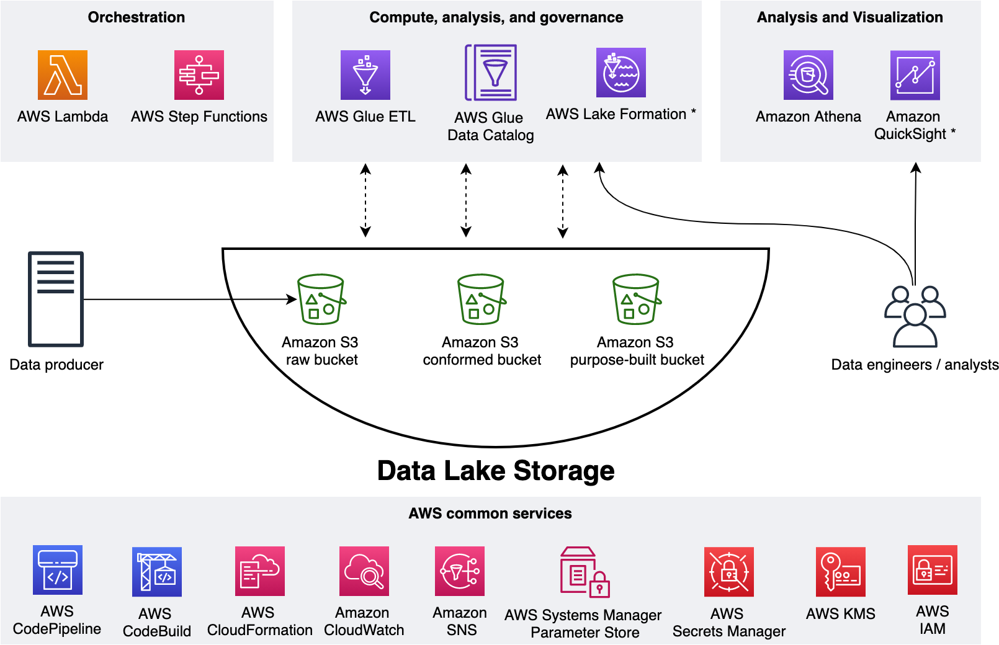

# AWS CDK Pipelines for Data Lake Infrastructure Deployment

This solution helps you deploy data lake infrastructure on AWS using [AWS CDK Pipelines](https://docs.aws.amazon.com/cdk/latest/guide/cdk_pipeline.html).

[CDK Pipelines](https://docs.aws.amazon.com/cdk/api/latest/docs/pipelines-readme.html) is a construct library module for painless continuous delivery of CDK applications. CDK stands for Cloud Development Kit. It is an open source software development framework to define your cloud application resources using familiar programming languages.

This solution helps you to:

1. deploy ETL workloads on data lake
1. build CDK applications for your ETL workloads
1. deploy ETL workloads from a central deployment account to multiple AWS environments such as dev, test, and prod
1. leverage the benefit of self-mutating feature of CDK Pipelines. For example, whenever you check your CDK app's source code in to your version control system, CDK Pipelines can automatically build, test, and deploy your new version
1. increase the speed of prototyping, testing, and deployment of new ETL workloads

---

## Contents

* [Conceptual Data Lake](#Conceptual-Data-Lake)
* [Engineering the Data Lake](#Engineering-the-Data-Lake)
* [Data Lake Infrastructure](#Data-Lake-Infrastructure)
* [Centralized Deployment](##Centralized-Deployment)
* [Continuous Delivery of Data Lake Infrastructure](#Continuos-Delivery-of-Data-Lake-ETL-using-CDK-Pipelines)
* [Source Code Structure](#Source-Code-Structure)
* [Before Deployment](#before-deployment)
  * [AWS Environment Bootstrapping](#aws-environment-bootstrapping)
  * [Application Configuration](#application-configuration)
  * [Integration of AWS CodePipeline and GitHub.com](#integration-of-aws-codepipeline-and-github.com)
* [Deployment](#deployment)
  * [Deploying for the first time](#deploying-for-the-first-time)
  * [Iterative Deployment](#iterative-deployment)
* [AWS CDK](#AWS-CDK)
* [Contributors](#Contributors)
* [License Summary](#License-Summary)

---

## Conceptual Data Lake

To level set, let us design a data lake. As shown in the figure below, we use Amazon S3 for storage. We use three S3 buckets - 1) raw bucket to store raw data in its original format 2) conformed bucket to store the data that meets the quality requirements of the lake 3) purpose-built data that is used by analysts and data consumers of the lake.

The Data Lake has one producer which ingests files into the raw bucket. We use AWS Lambda and AWS Step Functions for orchestration and scheduling of ETL workloads.

We use AWS Glue for ETL and data cataloging, Amazon Athena for interactive queries and analysis. We use various AWS services for logging, monitoring, security, authentication, authorization, notification, build, and deployment.

**Note:** [AWS Lake Formation](https://aws.amazon.com/lake-formation/) is a service that makes it easy to set up a secure data lake in days. [Amazon QuickSight](https://aws.amazon.com/quicksight/) is a scalable, serverless, embeddable, machine learning-powered business intelligence (BI) service built for the cloud. These two services are not used in this solution.



---

## Engineering the Data Lake

To engineer the data lake, we will create two source code repositories. They are:

1. source code repository for data lake infrastructure
1. source code repository for ETL process

In a general sense, one code repo is sufficient for the whole data lake infrastructure and each ETL process has its own code repo. We will apply this principle to this solution.

---

## Data Lake Infrastructure

Now we have the Data Lake design, let's deploy its infrastructure. It includes the following resources:

 1. Amazon Virtual Private Cloud (VPC)
 1. Subnets
 1. Security Groups
 1. Route Table(s)
 1. VPC Endpoints
 1. Amazon S3 buckets for:
    1. raw data
    1. conformed data
    1. purpose built
 1. Amazon DynamoDB tables for:
    1. configuration metadata for ETL jobs
    1. job audit table

Figure below represents the infrastructure resources we provision for Data Lake.


---

## Centralized Deployment

To demonstrate this feature, we need 4 AWS accounts as follows:

  1. Central deployment account to create CDK pipelines
  1. Dev account for dev data lake
  1. Test account for test data lake
  1. Prod account for production data lake

Figure below represents the centralized deployment model.


There are few interesting details to point out here:

  1. **Data Lake infrastructure source code** is organized into three branches - dev, test, and production
  1. Each branch is mapped to a CDK pipeline and it turn mapped to a target environment. This way, code changes made to the branches are deployed iteratively to their respective target environment
  1. From CDK perspective, we apply the the following bootstrapping principles
      1. the central deployment account will utilize a standard bootstrap
      1. each target account will require a cross account trust policy to allow access from the centralized deployment account

---

## Continuous Delivery of ETL Jobs using CDK Pipelines

Figure below illustrates the continuous delivery of ETL jobs on Data Lake.


There are few interesting details to point out here:

1. DevOps administrator checks in the initial code
1. DevOps administrator performs a one-time `cdk deploy --all` to deploy the data lake infrastructure to all target environments
1. CDK pipelines executes a multi-stage pipeline that includes, cloning the source code from GitHub repo, build the code, publish artifacts to S3 bucket, executes one or more stages/ Deployment of infrastructure resources is one of the stages
1. CDK pipelines deploy the resources to dev, test, and prod environments

## Source Code Structure

Table below explains how this source ode structured:

  | File / Folder    | Description  |
  |------------------| -------------|
  | [app.py](aws_cdk_pipelines_blog_datalake_infrastructure/app.py) | Application entry point. |
  | [pipeline_stack](aws_cdk_pipelines_blog_datalake_infrastructure/pipeline_stack.py) | Pipeline stack entry point. |
  | [pipeline_deploy_stage](aws_cdk_pipelines_blog_datalake_infrastructure/pipeline_deploy_stage.py) | Pipeline deploy stage entry point. |
  | [s3_bucket_stack](aws_cdk_pipelines_blog_datalake_infrastructure/s3_bucket_stack.py) | Contains all resources related to Data Lake zones (Staging, Raw, and Conformed). This includes: KMS Key and Key Policy, S3 Bucket (access logs and data lake storage) with lifecycle rules and bucket policy. |
  | [vpc_stack](aws_cdk_pipelines_blog_datalake_infrastructure/vpc_stack.py) | Contains all resources related to the VPC used by Data Lake infrastructure and services. This includes: VPC, Security Groups, and VPC Endpoints (both Gateway and Interface types). |
  | *resources*| This folder has architecture and process flow diagrams for Infrastructure and CDK Pipelines. |

---

## Prerequisites

We provided the following scripts to complete pre-deployment steps:

  | # | Script    | Purpose  |
  | --|-----------| -------------|
  | 1 | [bootstrap_deployment_account.sh](./lib/prerequisites/bootstrap_deployment_account.sh) | ***To be added by Isaiah Grant*** |
  | 2 | [bootstrap_target_account.sh](./lib/prerequisites/bootstrap_target_account.sh) | ***To be added by Isaiah Grant*** |
  | 3 | [configure_account_parameters.py](./lib/prerequisites/configure_account_parameters.py) | ***To be added by Isaiah Grant*** |
  | 4 | [configure_account_secrets.py](./lib/prerequisites/configure_account_secrets.py) | ***To be added by Isaiah Grant*** | 

Before you proceed further, make sure you configured your AWS CLI. If not, refer to [Configuring the AWS CLI](https://docs.aws.amazon.com/cli/latest/userguide/cli-chap-configure.html) for more details.

### AWS Environment Bootstrapping

Environment bootstrap is standard CDK process to prepare an AWS environment ready for deployment. Follow the steps:

 1. Install compatible CDK version

 ```{bash}
 npm install -g aws-cdk@1.109.0
 ```

 1. Go to the root directory where CDKApp.py is

 1. Set environment variable ```export AWS_PROFILE=deployment_account_profile```

 1. Create a Python virtual environment, activate it, and install all dependencies

   ```{bash}
   python3 -m venv .venv
   source .venv/bin/activate
   ```

1. Expected output:

   (.venv) 8c85906ee187:aws-cdk-pipelines-datalake-infrastructure itharav$ ls -lart .venv/
   total 8
   drwxr-xr-x   2 itharav  staff   64 Jun 23 15:25 include
   drwxr-xr-x   3 itharav  staff   96 Jun 23 15:25 lib
   drwxr-xr-x   6 itharav  staff  192 Jun 23 15:25 .
   -rw-r--r--   1 itharav  staff  114 Jun 23 15:25 pyvenv.cfg
   drwxr-xr-x  16 itharav  staff  512 Jun 23 15:27 bin
   drwxr-xr-x  21 itharav  staff  672 Jun 23 15:28 ..

1. Install dependencies

```{bash}
   pip install -r requirements.txt
```

1. Expected output:

   ```{bash}
      ls -lart .venv/lib/python3.9/site-packages/
   ```

 1. Bootstrap central deployment account, run the below command:

    ```{bash}
    ./lib/prerequisites/bootstrap_deployment_account.sh
    ```

    **Important:**
     1. Your configured environment *must* target the centralized deployment account
     1. You may need to add execute permissions for shell script. use the command ```chmod 700 bootstrap_deployment_account.sh```

 1. 

   Are you sure you want to bootstrap {
      "UserId": "AIDA3DWALPX7AP7OVT62S",
      "Account": "763833843198",
      "Arn": "arn:aws:iam::763833843198:user/itharavi-admin"
   }? (y/n)y

 1. Expected output 1:

    ✅  Environment aws://763833843198/us-east-2 bootstrapped.

 1. Expected output 2: you will see a stack created in your deployment account as follows

    

 1. Set environment variable ```export AWS_PROFILE=dev_account_profile```

 1. Set execute permissions

   ```{bash}
   chmod 700 ./lib/prerequisites/bootstrap_target_account.sh```
   ```

 1. Bootstrap dev account, run the below command:

    ```{bash}
    ./lib/prerequisites/bootstrap_target_account.sh <central_deployment_account_id>
    ```
  
 1. You will see the following 

   Are you sure you want to bootstrap {
    "UserId": "AIDAUBPAMTTLBYVEJ3SXX",
    "Account": "278032850134",
    "Arn": "arn:aws:iam::278032850134:user/thiru"
   } providing a trust relationship to: 763833843198? (y/n)

    **Important:** Your configured environment *must* target the appropriate account for **each** account

 1. Expected output 1:

  ✅  Environment aws://278032850134/us-east-1 bootstrapped.

 1. Expected output 2: you will see a stack created in your deployment account as follows

    

 1. Bootstrap test account, run the below command:

    ```{bash}
    ./lib/prerequisites/bootstrap_target_account.sh <central_deployment_account_id> arn:aws:iam::aws:policy/AdministratorAccess
    ```
 1. 

 Are you sure you want to bootstrap {
    "UserId": "AIDAWJAMLLE6LV2UXMZ52",
    "Account": "431670122812",
    "Arn": "arn:aws:iam::431670122812:user/itharavi"
} providing a trust relationship to: 763833843198 using policy arn:aws:iam::aws:policy/AdministratorAccess? (y/n)

 1. Expected output: ***To be added by Isaiah Grant***

 1. Bootstrap prod account, run the below command:

    ```{bash}
    ./lib/prerequisites/bootstrap_target_account.sh <central_deployment_account_id>
    ```

 1. Expected output 1:

  ✅  Environment aws://431670122812/us-east-2 bootstrapped.

 1. Expected output 2: you will see a stack created in your deployment account as follows

    

---

### Application Configuration

Before we deploy our resources we must provide the manual variables and upon deployment the CDK Pipelines will programmatically provide variables for managed resources. We use [AWS Systems Manager Parameter Store](https://docs.aws.amazon.com/systems-manager/latest/userguide/systems-manager-parameter-store.html) for this and they are are stored in the central deployment account. Follow the below steps:

1. **Note:** It is safe to commit these values to your repository

1. 1. Set environment variable

   ```export AWS_PROFILE=deployment_account_profile```

1. Go  to, [configure_account_parameters.py](./lib/prerequisites/configure_account_parameters.py) and fill in values of the `all_parameters` dict as desired

1. 
1. run the below command to configure parameters for **dev** account

   ```{bash}
   # First configure AWS for the Deployment Account
   python3 ./lib/prerequisites/configure_account_parameters.py
   ```
1. You will see the following:

Are you sure you want to deploy:

```{json}
   {
   "Deployment": {
      "account_id": "763833843198",
      "region": "us-east-2",
      "github_repository_owner_name": "aws-samples",
      "github_repository_name": "aws-cdk-pipelines-datalake-infrastructure",
      "logical_id_prefix": "CdkBlog",
      "resource_name_prefix": "cdkblog-test"
   },
   "Dev": {
      "account_id": "431670122812",
      "region": "us-east-2",
      "vpc_cidr": "10.20.0.0/24"
   },
   "Test": {
      "account_id": "278032850134",
      "region": "us-east-1",
      "vpc_cidr": "10.10.0.0/24"
   },
   "Prod": {
      "account_id": "927825637834",
      "region": "us-east-2",
      "vpc_cidr": "10.0.0.0/24"
   }
}

To account: 763833843198? This should be Central Deployment Account Id
```


1. Expected output:

```bash
Pushing Parameter: /DataLake/Deployment/AccountId
Pushing Parameter: /DataLake/Deployment/Region
Pushing Parameter: /DataLake/Infrastructure/RepositoryOwnerName
Pushing Parameter: /DataLake/Infrastructure/RepositoryName
Pushing Parameter: /DataLake/Infrastructure/CloudFormationLogicalIdPrefix
Pushing Parameter: /DataLake/Infrastructure/ResourceNamePrefix
Pushing Parameter: /DataLake/Dev/AccountId
Pushing Parameter: /DataLake/Dev/Region
Pushing Parameter: /DataLake/Dev/VpcCidr
Pushing Parameter: /DataLake/Test/AccountId
Pushing Parameter: /DataLake/Test/Region
Pushing Parameter: /DataLake/Test/VpcCidr
Pushing Parameter: /DataLake/Prod/AccountId
Pushing Parameter: /DataLake/Prod/Region
Pushing Parameter: /DataLake/Prod/VpcCidr
```

1. Expected output:

 

---

### Integration of AWS CodePipeline and GitHub.com

Integration between AWS CodePipeline and GitHub requires a personal access token. This access token is stored in Secrets Manager. This is a one-time setup and is applicable for all target AWS environments and all repositories created under the organization in GitHub.com. Follow the below steps:

1. **Note:** Do NOT commit these values to your repository

1. Go to, [configure_account_secrets.py](./lib/prerequisites/configure_account_secrets.py) and fill in the value for attribute **GITHUB_TOKEN** in `all_secrets` dictionary

1. Run the below command

   ```{bash}
   # Make sure your configuration points to Deployment Account
   python3 ./lib/prerequisites/configure_account_secrets.py
   ```

1. Expected output 1:

 ```bash
 Pushing Secret: /DataLake/GitHubToken
 ```

1. Expected output 2:
A secrets is added to AWS Secrets Manager with name **/DataLake/GitHubToken**

---

## Deployment

### Deploying for the first time

Configure your AWS profile to target the central Deployment account as an Administrator and perform the following steps:

1. Open command line (terminal)
1. Go to project root directory where ```cdk.json``` and ```app.py``` exist
1. Run the command ```cdk ls```
1. Expected output: It lists CDK Pipelines and target account stacks on the console
1. Sample output:

   ```bash
   cross-region-stack-763833843198:us-east-1
   
   DevCdkBlogInfrastructurePipeline
   ProdCdkBlogInfrastructurePipeline
   TestCdkBlogInfrastructurePipeline

   DevCdkBlogInfrastructurePipeline/Dev/DevCdkBlogInfrastructureIam
   DevCdkBlogInfrastructurePipeline/Dev/DevCdkBlogInfrastructureS3BucketZones
   DevCdkBlogInfrastructurePipeline/Dev/DevCdkBlogInfrastructureVpc

   ProdCdkBlogInfrastructurePipeline/Prod/ProdCdkBlogInfrastructureIam
   ProdCdkBlogInfrastructurePipeline/Prod/ProdCdkBlogInfrastructureS3BucketZones
   ProdCdkBlogInfrastructurePipeline/Prod/ProdCdkBlogInfrastructureVpc

   TestCdkBlogInfrastructurePipeline/Test/TestCdkBlogInfrastructureIam
   TestCdkBlogInfrastructurePipeline/Test/TestCdkBlogInfrastructureS3BucketZones
   TestCdkBlogInfrastructurePipeline/Test/TestCdkBlogInfrastructureVpc
   ```

1. Run the command ```cdk deploy --all```
1. Expected output:
    1. It creates new Pipelines in CodePipeline in the Deployment account
    1. It creates one or more CloudFormation Stacks in target AWS Account
    1. In the target AWS account, all AWS resources constituted by the CloudFormation stack will be provisioned

---

### Iterative Deployment

Pipeline you have created using CDK Pipelines module is self mutating. That means, code checked to GitHub repository branch will kick off CDK Pipeline mapped to that branch.

---

## AWS CDK

Refer to [cdk_instructions.md](./resources/cdk_instructions.md) for detailed instructions

---

## Contributors

1. **Ravi Itha**, Senior Data Architect, Amazon Web Services
1. **Muhammad Zahid Ali**, Data Architect, Amazon Web Services
1. **Isaiah Grant**, Cloud Consultant, 2nd Watch, Inc.

---

## License Summary

This sample code is made available under the MIT-0 license. See the LICENSE file.
